# Devops lab Jenkins

First we Would download the jenkins from github.

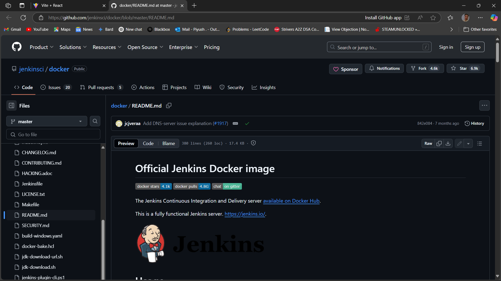

Then we would use the command in CLI

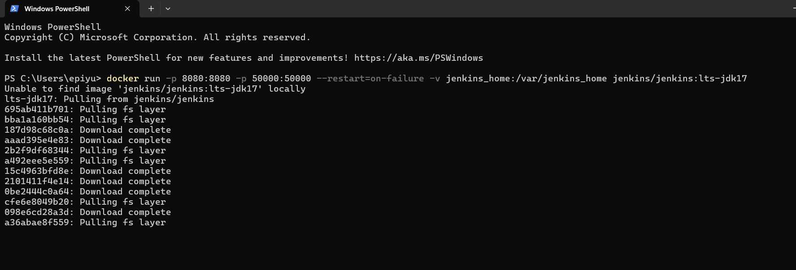

Start the docker engine

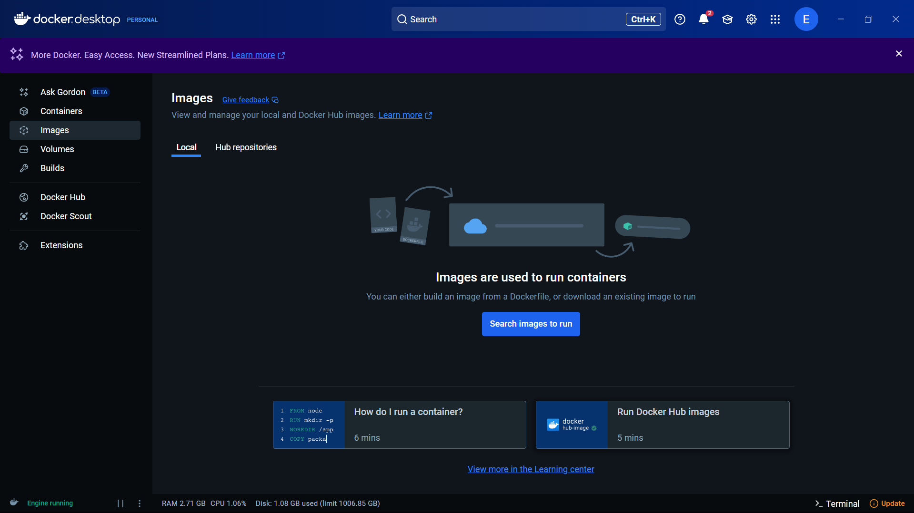

we would get a passcode for jenkins

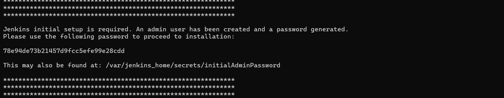

Use passcode to access

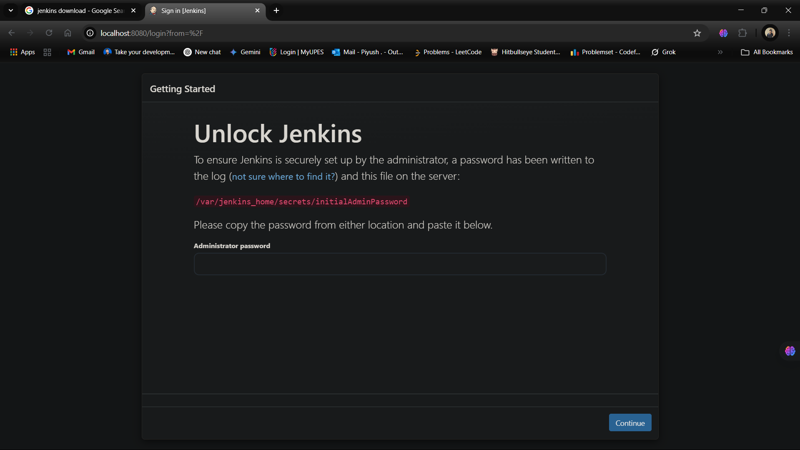

customise it accordingly

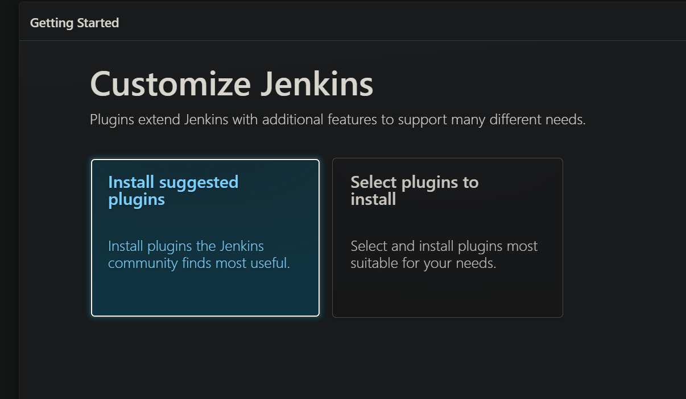

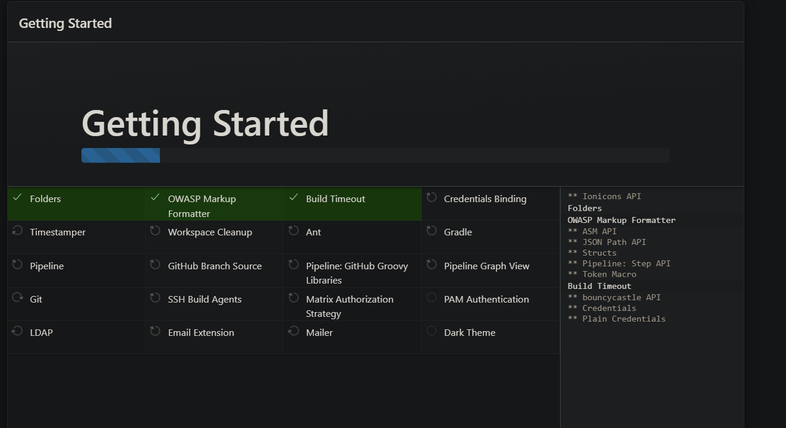

Create your account

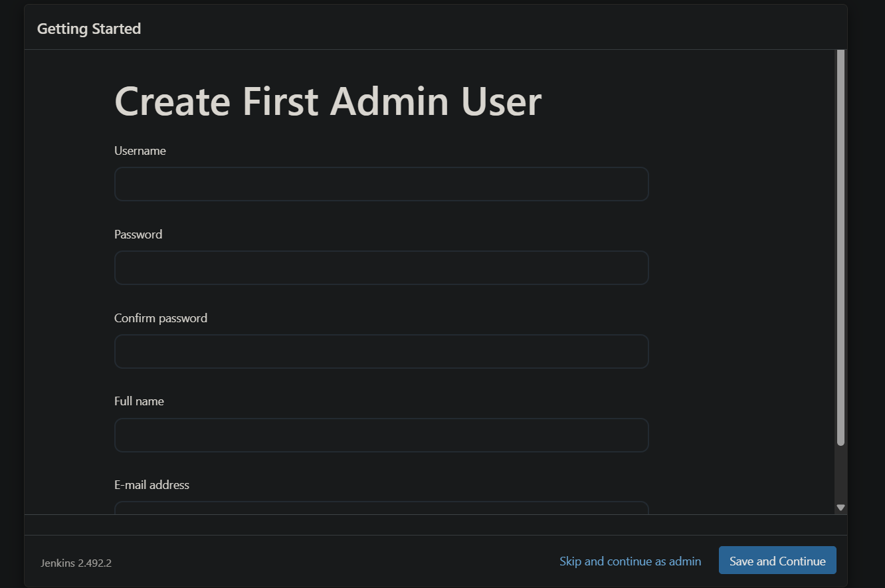

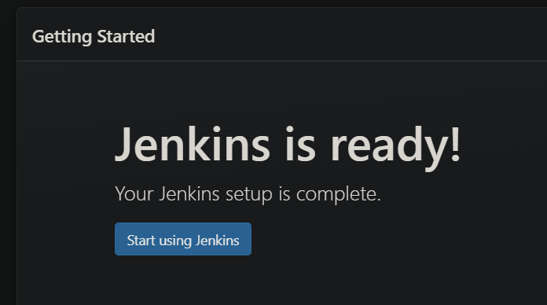

Analyze the features provided by jenkins

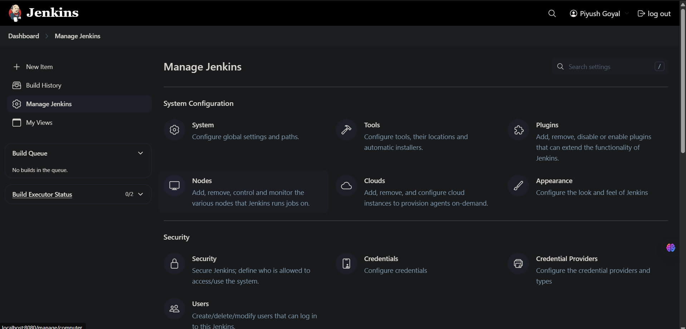

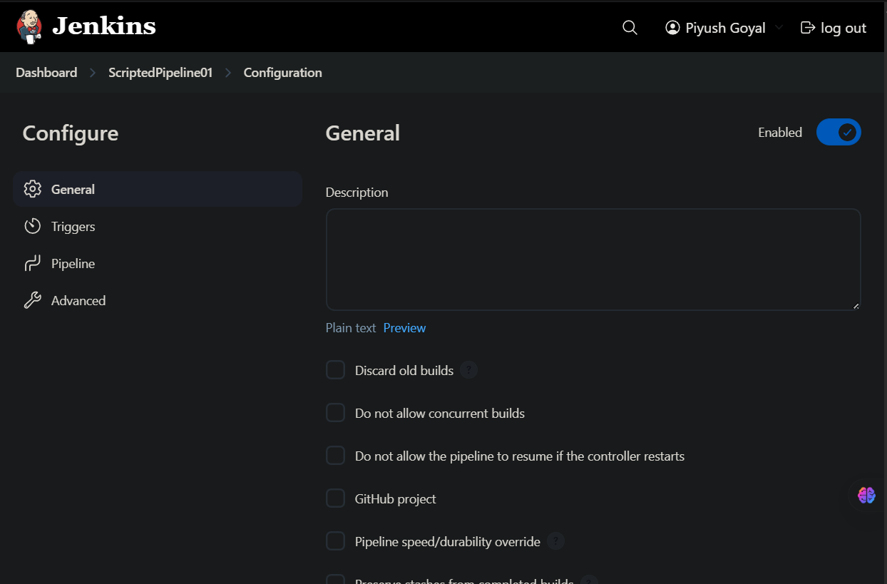

Create a pipeline with pregiven code of groovy

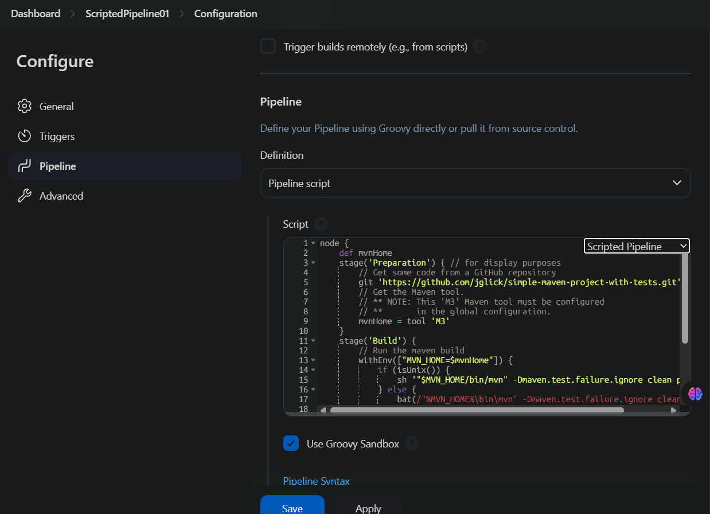

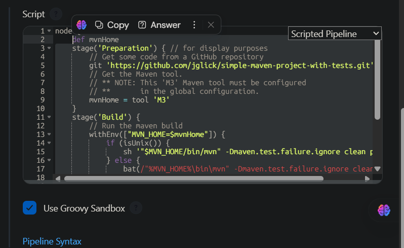

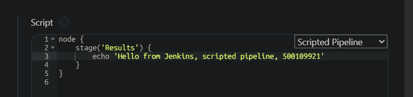

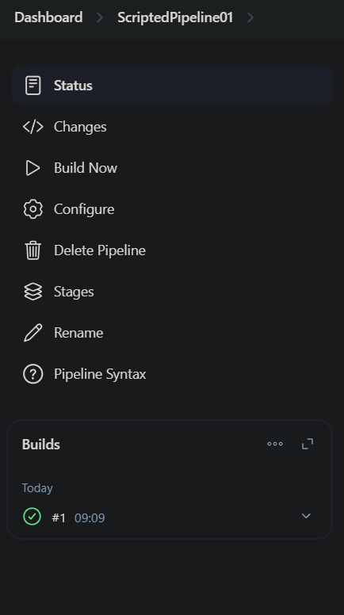

Analyse and check the build and it’s checks

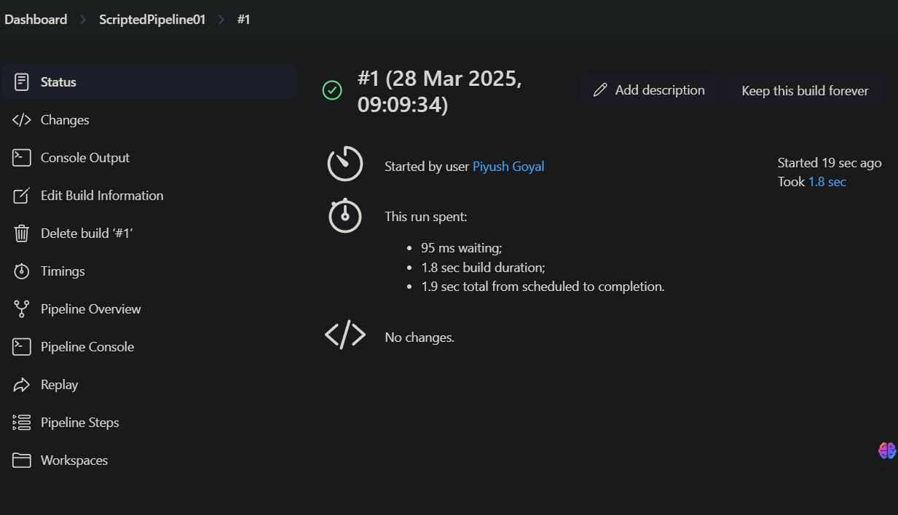

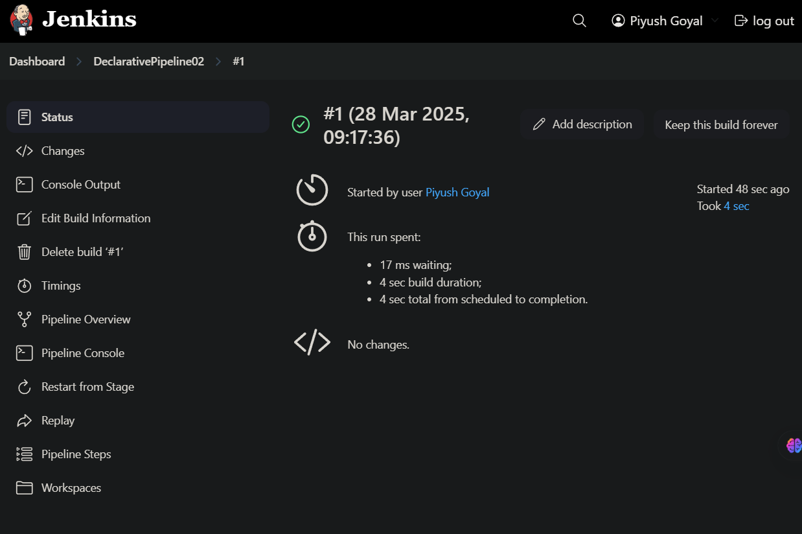

